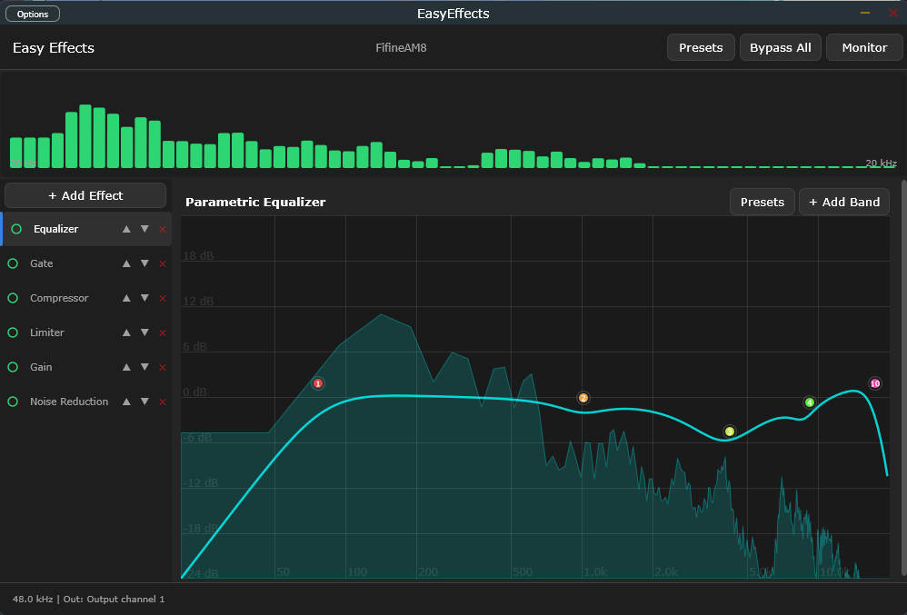

# EasyEffects Windows Porting

A native Windows audio effects processor inspired by [EasyEffects](https://github.com/wwmm/easyeffects) for Linux.



## Tutorial Video
<video src="screenshots/EasyEffects%20Tutorial.mp4" controls width="600"></video>

## ⚠️ What this project IS
A real-time, modular DSP audio processing chain for Windows, built with C++ and JUCE. It provides 25+ professional audio effects, spectrum analysis, and flexible routing.

## ⚠️ What it is NOT
**This is NOT system-wide by default.** Unlike the Linux version which uses PipeWire to natively hijack all system audio, Windows does not allow this easily. 
👉 **For system-wide audio processing, you MUST use a Virtual Audio Cable (like VB-Cable).** See the routing guide below.

## 🚧 Current Status: Alpha / Under Development
**Please note:** This project is currently in the **Alpha** stage and is under active development. While the core architecture and many effects are stable, you may encounter bugs, UI glitches, or unoptimized CPU usage. Some specific audio effects might not yet work perfectly or exactly match their Linux counterparts. We appreciate your patience and bug reports!

---

## ✨ Feature Highlights

- **Real-time DSP Chain:** Dynamically add, remove, and reorder effects with zero audio stuttering.
- **25+ Professional Effects:** Including 10-Band Parametric EQ, Compressor, RNNoise (AI Noise Reduction), Pitch Shifter, Exciter, Limiter, and more.
- **Advanced Analytics:** Real-time 2048-point lock-free FFT Spectrum Analyzer and dynamic I/O metering.
- **Preset System:** Save and load full chain configurations or per-module presets (JSON based).
- **Standalone & VST3:** Run as a standalone desktop app or load it as a VST3 plugin in OBS Studio or your favorite DAW.

---

## 📥 Download & Installation

1. Go to the [Releases](../../releases) page.
2. Download the latest `EasyEffects-Windows-vX.X.X.zip`.
3. Extract the folder.
4. Run `EasyEffects.exe`.

---

## 🎙️ Microphone Audio Setup (Voice Processing)

To process your microphone for Discord, Zoom, or OBS:

1. Download and install a free Virtual Audio Cable like [VB-Cable](https://vb-audio.com/Cable/).
2. Open EasyEffects Windows. Click **Options -> Audio Settings**.
3. Set **Input** to your physical microphone (e.g., *HyperX QuadCast* or *Focusrite USB*).
4. Set **Output** to **CABLE Input**.
5. In your chat application (Discord, Zoom, etc.), set your input device to **CABLE Output**.

Now your microphone is processed by EasyEffects before reaching your chat apps!

---

## 🎧 System-Wide Audio Setup (Virtual Cable)

To process audio from games, Spotify, or your whole system:

1. Download and install a free Virtual Audio Cable like [VB-Cable](https://vb-audio.com/Cable/).
2. In Windows Sound Settings, set your Default Playback Device to **CABLE Input**.
3. Open EasyEffects Windows. Click **Options -> Audio Settings**.
4. Set **Input** to **CABLE Output**.
5. Set **Output** to your physical headphones/speakers.

Now, all system audio routes through EasyEffects before reaching your ears!

---

## 🔌 VST3 Installation (For OBS / DAWs)

1. From the release zip, copy the `EasyEffects.vst3` folder.
2. Paste it into your system's VST3 directory:
   `C:\Program Files\Common Files\VST3\`
3. Restart OBS Studio or your DAW, and EasyEffects will appear in your plugins list.

---

## 🛠️ Build from Source

You will need:
- Windows 10/11
- Visual Studio 2022 (or newer) with C++ Desktop Development tools
- CMake (3.24+)
- Git

### 1. Clone the repository and submodules
```bash
git clone https://github.com/YOUR_USERNAME/easyeffects-windows.git
cd easyeffects-windows
git submodule update --init --recursive
```

### 2. Generate and Build
```bash
cmake -B build -G "Visual Studio 17 2022" -A x64
cmake --build build --config Release
```

### 3. Run or Package
You can run the compiled standalone executable directly:
`build/EasyEffects_artefacts/Release/Standalone/EasyEffects.exe`

Alternatively, you can use the provided PowerShell script to package the release:
```powershell
# Create a folder release
powershell -ExecutionPolicy Bypass -File scripts\package_release.ps1 -NoZip

# Or create a Zip archive
powershell -ExecutionPolicy Bypass -File scripts\package_release.ps1
```
The output will be placed in the `releases/` directory.

---

## ⚖️ License & Compliance

This project is licensed under the **GNU General Public License v3.0 (GPLv3)**. See the `LICENSE` file for details.

**External Libraries:**
- [JUCE Framework](https://juce.com/) (GPLv3 for open source)
- [RNNoise](https://github.com/xiph/rnnoise) (BSD 3-Clause)
- [SoundTouch](https://codeberg.org/soundtouch/soundtouch) (LGPL) - Dynamically linked where applicable or utilized under LGPL compliance terms.

---

## AI-Assisted Development

**Full disclosure:** The vast majority of the C++ architecture, JUCE implementation, and DSP porting in this repository was heavily assisted and generated by AI (specifically Google's Gemini / Claude) acting as a pair-programmer. It was guided and architected by a human, but the code itself was largely AI-written.

---

*Disclaimer: This project is an independent Windows port and is not directly affiliated with the original EasyEffects Linux developers.*
