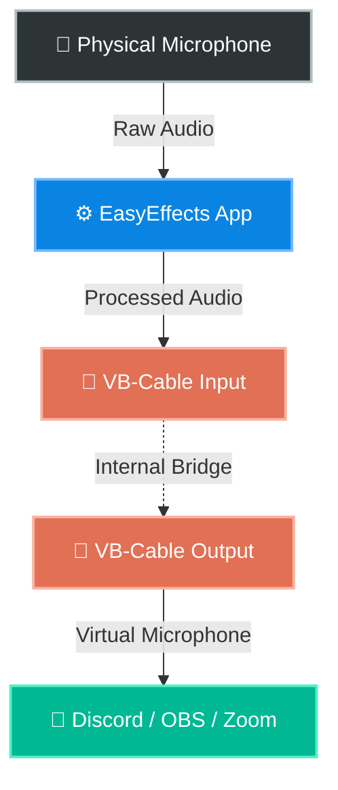
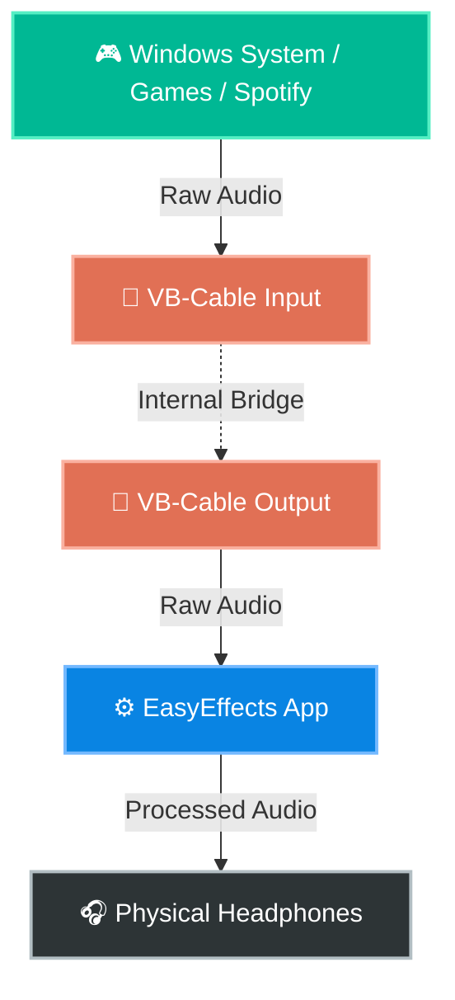

# Why Do We Need a Virtual Audio Cable?

When making your video, you can use the diagrams and scripts below to visually explain to your viewers exactly why VB-Cable is required and how the audio flows.

---

## 🎙️ The Microphone Problem (Script)

**Voiceover / On-Screen Text:**
> "On Linux, the original EasyEffects uses a technology called PipeWire, which acts like a master switchboard for all system audio. It can intercept any app's audio, process it, and send it back out seamlessly. Windows, however, doesn't allow apps to easily hijack the system audio stream. If you select your microphone inside EasyEffects, the app processes the sound, but it has nowhere to send it! We need a 'bridge' to carry that processed audio from EasyEffects into your chat applications like Discord or OBS. That bridge is a Virtual Audio Cable."

## 📊 Visual Diagram: Microphone Flow

---

## 🎧 The System Audio Problem (Script)

**Voiceover / On-Screen Text:**
> "The same logic applies if you want to use EasyEffects to improve the sound of your headphones while playing games or listening to Spotify. Windows will try to send the game audio directly to your headphones. To process it first, we tell Windows to send the audio to the Virtual Cable instead. EasyEffects listens to that Virtual Cable, applies your EQ and Bass enhancements, and then finally pushes the perfect, processed sound out to your physical headphones."

## 📊 Visual Diagram: System / Speakers Flow

---

## 🎬 Tips for the Video
1. **Show the Windows Sound Settings:** Show your mouse changing the Windows Default device to `CABLE Input`. Visualizing the Windows menu makes the "hijacking" concept click for viewers.
2. **Show the EasyEffects Routing:** Show yourself explicitly selecting `CABLE Output` in the EasyEffects Audio Settings dropdown. 
3. **The "Aha!" Moment:** Show Discord's settings where you select `CABLE Output` as your microphone. Mention that Discord now "thinks" the Virtual Cable is your microphone, but it's actually receiving the heavily processed audio from EasyEffects.
